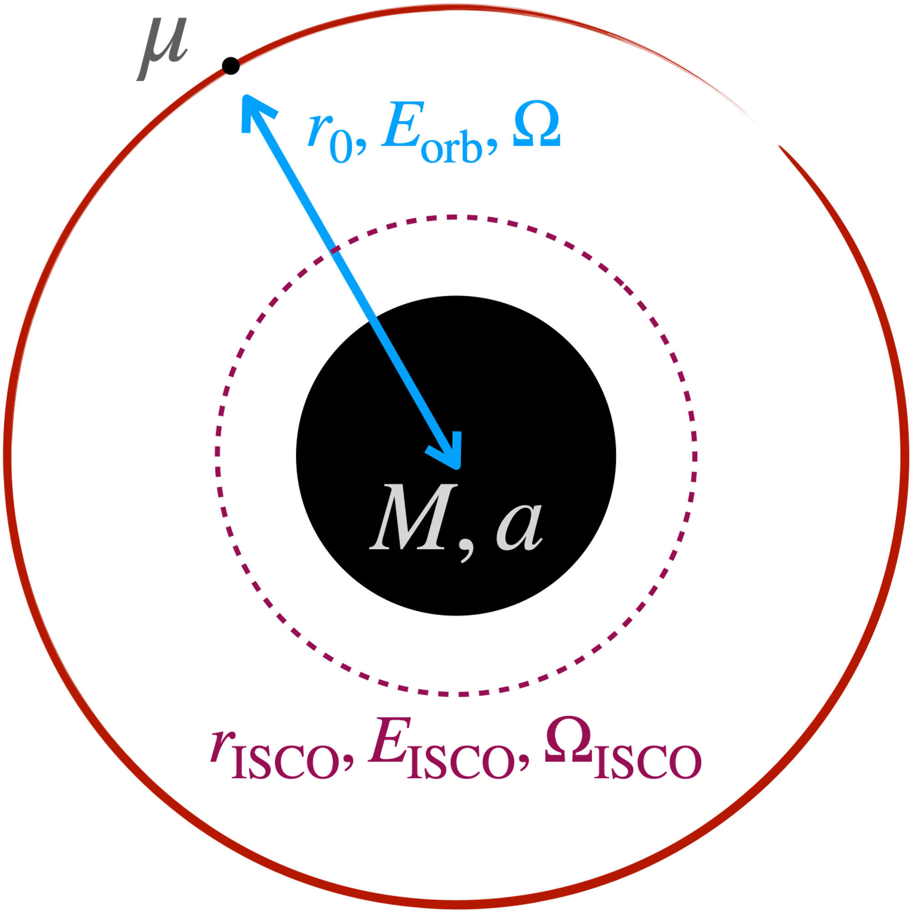

Background
==========

We give a brief overview of adiabatic inspirals and waveforms within the
context of black hole perturbation theory and the self-force formalism, with a focus on 
quasi-circular inspirals. This also serves as a reference for the conventions and notation used
throughout the documentation in the :doc:`api/api` section. More in depth reviews of
adiabatic inspirals and waveforms can be found within the :doc:`ref` section.

Adiabatic inspirals
-------------------

    
First we focus on the motion of a small body with mass :math:`\mu` on a bound orbit about
a massive black hole (MBH) with mass :math:`M` and Kerr spin parameter :math:`a`. Assuming that
:math:`\mu \ll M`, then the leading-order motion is given by a geodesic.
In the restricted case that this leading-order motion is circular, then we can describe the geodesic 
in terms of its (Boyer-Lindquist) radius :math:`r_\mathrm{orb}`, 
its orbital energy :math:`E_\mathrm{orb}`, and its orbital frequency :math:`\Omega.` 
These can all be expressed in terms of the velocity parameter :math:`v^2 = M/r_\mathrm{orb}` and dimensionless
Kerr spin parameter :math:`q = a/M` `(Detweiler; 1978)`_,

.. math::
    E_\mathrm{orb} &= \frac{1 - 2 v^2 + q v^3}{\sqrt{1-3v^2+ 2qv^3}},
    \\
    \Omega &= \frac{v^3}{M(1 + q v^3)}.
    :label: geoparams

Due to small body's mass :math:`\mu`, the binary emits gravitational waves, which radiate away 
energy. This is captured by the time-averaged GW flux :math:`\langle \dot{E} \rangle_\mathrm{GW}`.
Thus the small body cannot remain on a geodesic. In the adiabatic approximation,
we assume that the time-rate-of-change of orbital energy must be balanced by the GW flux. Therefore,
the orbit evolves according to the adiabatic equations of motion,

.. math::
    \frac{dE_\mathrm{orb}}{dt} &= - \langle \dot{E}\rangle_\mathrm{GW},
    \\
    \frac{d\Phi}{dt} &= \Omega,
    :label: fluxbalance

where :math:`\Phi` is the orbital phase of :math:`\mu`. Consequently, the trajectory of the small 
body (in Boyer-Lindquist coordinates) is given by

.. math::
    x^\mu_p = (t_p,r_p,\theta_p,\phi_p) = (t, r_\mathrm{orb}(E_\mathrm{orb}(t)), \pi/2, \Phi(t)).
    :label: traj

We consider the small body to rapidly plunge and merge with the MBH when :math:`r_\mathrm{orb}(t=t_\mathrm{merge}) = r_\mathrm{ISCO}`, where 
:math:`r_\mathrm{ISCO}` is the radius of the innermost stable circular orbit (ISCO), given by

.. math::
    r_\mathrm{ISCO} &= 3 + z_2 - \mathrm{sgn}(q)
    \sqrt{(3 - z_1)(3 + z_1 + 2z_2)},
    \\
    z_1 & = 1 + (1 - q^2)^{1/3}
    \left((1-q)^{1/3} + (1 + q)^{1/3} \right),
    \\
    z_2 &= \sqrt{3 q^2 + z_1^2}.
    :label: isco

Note that :math:`q<0` represents a retrograde orbit: an orbit where the orbital angular momentum of 
the small body and spin angular momentum of the MBH are anti-aligned.

Adiabatic waveforms
-------------------

From this adiabatic inspiral, we construct
the resulting adiabatic gravitational waveform. It can be expressed as a sum over many
harmonics with complex amplitudes :math:`H_{lm}(t) = H_{lm}(r_\mathrm{orb}(t))` and phases :math:`\Phi_m(t) = m\Phi(t)`,

.. math::
    h(t, r_\mathrm{obs}, \theta_\mathrm{obs}, \phi_\mathrm{obs}) &= \frac{\mu}{r_\mathrm{obs}} \sum_{l=2}^\infty \sum_{|m|=1}^{l} H_{lm}(t) e^{i\Phi_m(t)} {}_{-2} Y_{lm}(\theta_\mathrm{obs}, \phi_\mathrm{obs}),
    \\
    &= \sum_{l=2}^\infty \sum_{|m|=1}^{l} h_{lm}(t,r_\mathrm{obs}, \theta_\mathrm{obs}, \phi_\mathrm{obs}),
    \\
    &= h_+(t) - i h_\times(t),
    :label: hsum_full

where :math:`(r_\mathrm{obs}, \theta_\mathrm{obs}, \phi_\mathrm{obs})` is the position of the
observor in Boyer-Lindquist coordinates, :math:`{}_{-2} Y_{lm}` is the spin-weighted spherical
harmonic of spin-weight :math:`-2`, and :math:`h_+` and :math:`h_\times` are the plus
and cross polarizations of the gravitational wave strain in the source frame (of the binary).
The slowly-varying amplitudes experience a change :math:`\Delta H_{lm} \sim O(1)` over
the inspiral, while the rapidly-varying phases experience a change :math:`\Delta H_{lm} \sim O(M/\mu)`.

Simplified waveform summation
-----------------------------
For circular orbits, the harmonic amplitudes possess the symmetry :math:`H_{l,-m} = (-1)^{l}\bar{H}_{lm}`,
where the overbar denotes complex conjugation. Similarly, the spin-weighted spherical harmonics
possess the relation :math:`{}_{s}Y_{l, -m} = (-1)^{s+m} {}_{-s} \bar{Y}_{lm}`. Combining these
and separating the complex amplitudes and spin-weighted spherical harmonics in terms of their magnitudes and phases,
i.e., :math:`H_{lm}(t) = A_{lm}(t) e^{i\phi_{lm}(t)}` and :math:`{}_{s}Y_{lm}(\theta,\phi) = {}_{s}y_{lm}(\theta) e^{im\phi}`, we find

.. math::
    h_{lm}^+ + h_{l, -m}^+ &= \frac{\mu}{r_\mathrm{obs}} A_{lm}({}_{-2} y_{lm} + (-1)^{l+m} {}_{+2}y_{lm})\cos(m\Phi - m\phi_\mathrm{obs} - \phi_{lm}),
    \\
    & = H^+_{lm},
    \\
    h_{lm}^\times + h_{l, -m}^\times &= \frac{\mu}{r_\mathrm{obs}} A_{lm}({}_{-2} y_{lm} - (-1)^{l+m} {}_{+2}y_{lm})\sin(m\Phi - m\phi_\mathrm{obs} - \phi_{lm}),
    \\
    & = H^\times_{lm}.
    :label: HlmPlusCross

This reduces the mode-sum over the waveform harmonics and allows one to easily separate the calculation
of the plus and cross polarizations,

.. math::
    h_{+,\times} = \sum_{l=2}^\infty \sum_{m = 1}^{l} H^{+,\times}_{lm}.
    :label: hsum

In :code:`bhpwave`, waveforms are generated using the mode-sum in Eq. :eq:`hsum`. Therefore,
requesting a specific :math:`(l, m)` mode returns the combination :math:`H^+_{lm} - i H^\times_{lm}`.
In other words, for a given value of :math:`m`, :code:`bhpwave` performs an internal sum over both 
the postive and negative values of :math:`m` by default.

Frequency domain waveforms
--------------------------

In progress...

.. _(Detweiler; 1978): https://ui.adsabs.harvard.edu/abs/1978ApJ...225..687D/abstract
.. _(Kennefick; 1998): https://journals.aps.org/prd/abstract/10.1103/PhysRevD.58.064012
.. _(Hughes; 2000): https://arxiv.org/abs/gr-qc/9910091
.. _(Drasco and Hughes; 2006): https://arxiv.org/abs/gr-qc/9910091
.. _(Gourgoulhon, et al.; 2019): https://www.aanda.org/articles/aa/abs/2019/07/aa35406-19/aa35406-19.html
.. _(Chua, et al.; 2020): https://arxiv.org/abs/2008.06071
.. _(Hughes, et al.; 2021): https://arxiv.org/abs/2102.02713
.. _(Katz, et al.; 2021): https://arxiv.org/abs/2104.04582